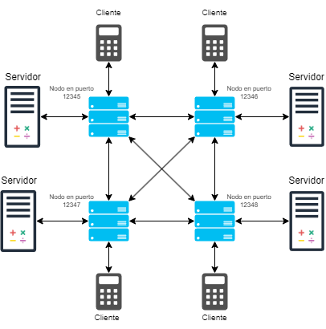
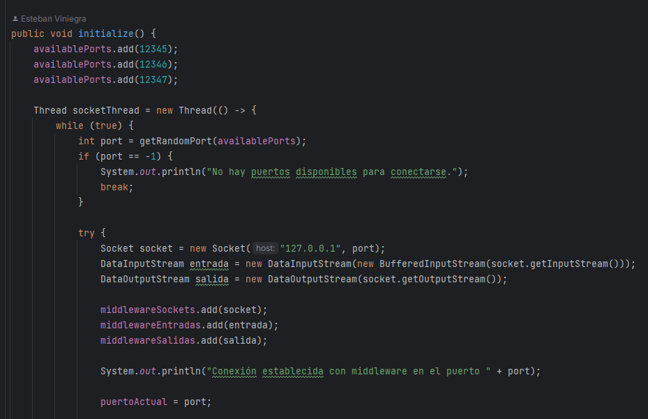
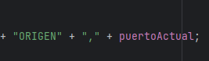
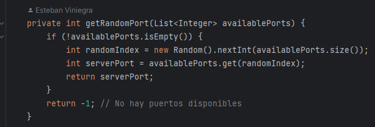
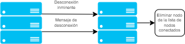
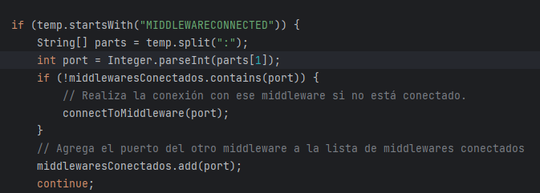
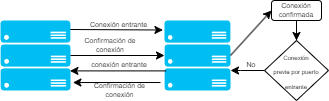

[^1] 

# Calculadora Distribuida Segunda Entrega

Esteban Viniegra Pérez Olagaray Universidad Panamericana, Escuela de Ingeniería.  \
Ingeniería en Inteligencia de datos y Ciberseguridad \
Materia: Cómputo Distribuido

**_Resumen_—Este informe aborda la segunda entrega del proyecto de una calculadora distribuida, en el contexto de la materia de Cómputo Distribuido. El objetivo general del proyecto es diseñar y desarrollar una calculadora que aproveche los principios del cómputo distribuido para dividir tareas y procesos en múltiples componentes y máquinas que trabajan simultáneamente. El alcance de esta segunda entrega se centra en la implementación de múltiples nodos middleware que forman una red en malla, permitiendo un enfoque descentralizado en la arquitectura.**

1. 
Introducción
E

l cómputo distribuido se ha convertido en una parte fundamental de la computación moderna al permitir la distribución de tareas y procesos en sistemas conectados. En este contexto, el proyecto de calculadora distribuida explora cómo aplicar estos principios para realizar operaciones matemáticas básicas de manera distribuida. Este enfoque tiene la ventaja de no depender de un único nodo para realizar los cálculos, lo que mejora la escalabilidad y la redundancia del sistema.

Fig 1. Diagrama de arquitectura distribuida y descentralizada del proyecto

2. 
Desarrollo
_A.		 Cliente_

El cliente ha sido actualizado para admitir la conexión dinámica a través de diferentes puertos en el middleware. Cada vez que se envía una solicitud de operación, el cliente selecciona aleatoriamente un middleware disponible para enviar la solicitud, lo que mejora la distribución de la carga y la redundancia. Además, el cliente puede especificar el "puerto de origen" en las solicitudes para que el nodo pueda identificar desde qué puerto se emitió la petición y ningún elemento del sistema es capaz de alterar este dato para asegurar que el paquete no regrese al nodo desde donde se emitió.

Fig 2. Cliente obteniendo un puerto aleatorio de la lista de puertos disponibles e intentando conectar con el nodo

Fig 3. Cliente agregando el puerto de origen al paquete de datos que será enviado

_B.		Servidor_

El servidor ha sido actualizado para conectarse de manera aleatoria a un nodo que se encuentre corriendo en alguno de los puertos dentro de la lista de puertos, además de eso, el código se modificó para que no se altere el puerto de origen del paquete de datos, asegurando la integridad de los datos recibidos y enviados sin alterar su función principal que consta de manejar las solicitudes entrantes de los clientes y realizar las operaciones matemáticas correspondientes. Cuando un servidor recibe una solicitud, realiza el cálculo y envía el resultado al middleware correspondiente. El servidor también se comunica con otros middlewares para reenviar solicitudes y resultados, lo que contribuye a la arquitectura descentralizada y la redundancia del sistema.

Fig 4. Selección aleatoria de puerto

_C.		Middleware (nodo)_

El middleware fue el elemento que más cambios sufrió para esta segunda entrega, se ha implementado un algoritmo mucho más flexible de manejo de clientes, así como de conexiones entre nodos.

El algoritmo que se implementó para la conexión con otros nodos le permite siempre estar conectado con todos los nodos en ejecución en los puertos dentro de la lista de puertos disponibles, incluso si ya se intentó realizar la conexión previamente y falló.

Fig 5. Algoritmo de conexión entre nodos

Como podemos observar en el diagrama de la figura 5, cada vez que un nodo se inicializa, lo primero que hace es intentar conectarse a todos los nodos que están en ejecución en los puertos contenidos por la lista de puertos disponibles, una vez que se realizó la conexión, se manda un mensaje con la confirmación de la conexión; el nodo al que se conectó el primer nodo busca en la lista de nodos conectados previamente y si no encuentra el puerto del que proviene la conexión entrante, ejecuta la misma acción. Esto abre un canal de comunicación bilateral para asegurar una conexión entre todos los nodos formando una red en malla para la distribución de mensajes de manera exitosa. 

Fig 6. Fragmento de código que muesta cómo se recibe el mensaje de confirmación de conexión, busca el nodo en la lista de nodos conectados y si no se encuentra, realiza la conexión.

También se implementó un mecanismo de apagado limpio que alerta de la desconexión de un nodo al resto de nodos conectados a dicho nodo. Esto para evitar errores como posibles falsos positivos al momento de revisar la lista de nodos conectados.

Fig 7. Alerta de desconexión inminente

Al momento de parar la ejecución de un nodo, manda una alerta a todos los nodos conectados para que este sea eliminado de la lista de nodos conectados de cada uno de los nodos.

Por último, para ejecutar el broadcast de los mensajes de manera controlada, se optó por mandar un paquete de datos que contiene el mensaje que le llegará al cliente o al servidor conteniendo el puerto de origen del mensaje. Gracias a esto, cuando el paquete de datos llega al nodo, este revisa el puerto del que proviene, si es del mismo puerto que el nodo, manda el paquete de datos al resto de nodos conectados y hace broadcast a los clientes o servidores que están conectados a él, pero de lo contrario, el paquete de datos únicamente es reenviado a los clientes o servidores conectados a dicho nodo.

3. 
Conclusiones
La implementación del middleware y la arquitectura descentralizada han mejorado significativamente la capacidad y la robustez del sistema de cómputo distribuido. Ahora, los clientes pueden conectarse dinámicamente a través de múltiples middlewares, lo que facilita la escalabilidad del sistema. 

Además, la redundancia y la capacidad de comunicación entre middlewares aumentan la confiabilidad del sistema. Sin embargo, todavía existen desafíos en la gestión de conexiones y la coordinación entre middlewares, que pueden ser abordados en futuras mejoras del proyecto.

# Referencias

1. G. Coulouris, J. Dollimore y T. Kindberg, Distributed Systems: Concepts and Design, 5th ed. Boston, MA: Addison-Wesley, 2011.
2.  A. K. Singh, “WebSocket Programming with Java,” Medium, 2023. [Online]. Disponible en: . [Accedido: 01-Nov-2023].
3. GeeksforGeeks, “What is a Distributed System?,” 2023. [Online]. [Accedido: 01-Nov-2023].
4.  J. A. Gómez, “Sockets en Java: Un sistema cliente-servidor con sockets,” 2023. [Online]. Disponible en: . [Accedido: 01-Nov-2023].

[^1]:
    * Escuela de ingeniería Universidad Panamericana.
